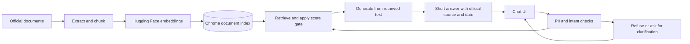

# HDFC Mutual Fund FAQ Assistant

A working product prototype that turns official mutual fund documents into short, cited answers. Ask about scheme fees, lock-in periods, benchmarks, or statement-download steps; the assistant answers from its document corpus and declines investment advice and returns comparisons.

**Built by Aishwarya Pillai for NextLeap PM, Milestone 4.** The project connects a product requirements document, a retrieval-augmented generation (RAG) implementation, a usable chat interface, and automated acceptance checks.

[Product requirements](PRD.md) | [Architecture](architecture.md) | [Implementation plan](implementation.md) | [Evaluation questions](tests/gold_set.json)

## The problem and the product

Common scheme facts are spread across factsheets, Key Information Memoranda (KIMs), and investor-education pages. Finding a fee or feature can mean reading several long documents. This assistant makes those facts easier to find while keeping the official source visible.

The product is deliberately scoped to five HDFC schemes. It is a facts-only demo, with no portfolio recommendations, live NAV tracking, return rankings, login, or transaction flows.

| Supported scheme | Category |
|---|---|
| HDFC Large Cap Fund | Large cap |
| HDFC Flexi Cap Fund, formerly HDFC Equity Fund | Flexi cap |
| HDFC ELSS Tax Saver Fund | ELSS / tax saver |
| HDFC Small Cap Fund | Small cap |
| HDFC Balanced Advantage Fund | Hybrid / balanced advantage |

The catalog primarily identifies Direct Growth plans. Plan-specific questions need a clear plan or option; facts are only available when the indexed text contains them.

## What this project demonstrates

- **Product definition:** a documented problem, user needs, scope, requirements, and acceptance criteria in the [PRD](PRD.md).
- **Grounded answers:** retrieval from official HDFC and AMFI documents; HDFC, AMFI, and SEBI links are allowlisted. Each normal assistant response carries one official source link and a source date. Factual answer bodies are capped at three sentences.
- **Policy before generation:** advice, performance comparisons, other AMCs, and detected personal identifiers take separate paths before the model is called. Ambiguous supported-fund questions ask for clarification.
- **A usable interface:** catalog-backed fund selector, contextual examples, loading feedback, duplicate-send prevention, readable source links, keyboard focus, and a responsive mobile layout. Rejected identifiers do not appear in the transcript.
- **Operational handling:** Groq fallback, bounded retries for brief rate limits, model/index compatibility checks, and staged embedding migration that preserves source metadata.
- **Evaluation:** a 10-question gold set plus regression tests for policies, APIs, citations, provider failures, embeddings, and preservation of the existing index when embedding calls fail.

## How it works



The recommended setup uses **Hugging Face hosted embeddings** (`BAAI/bge-small-en-v1.5`) and **Groq answer generation** (`openai/gpt-oss-20b`). If an Anthropic key is configured, the code tries Anthropic first and falls back to Groq. Leave that optional key empty for the Groq-only setup below.

The document index is built separately from chat requests. The app never crawls source pages while answering a question. Chroma stores document vectors and metadata; the backend does not maintain a chat-history or user-account database. The browser holds the current transcript in memory. Accepted factual questions and retrieved passages are sent to the configured inference providers.

## Install and run locally

### Prerequisites

- Git and Python. The current implementation was validated on **Python 3.14.6**.
- A [Groq API key](https://console.groq.com/keys).
- A [Hugging Face token](https://huggingface.co/settings/tokens) with **Make calls to Inference Providers** permission.
- Internet access for dependencies, source downloads, and hosted inference. Hosted provider usage is subject to account quotas and credits.

Run commands from the repository root, the folder containing `requirements.txt` and `app/`.

### 1. Clone and install

**Windows / PowerShell**

```powershell
git clone https://github.com/aishwaryapillaimrx-lang/mutual_fund_faq_ai_assistant.git
cd mutual_fund_faq_ai_assistant
python --version
python -m venv .venv
.venv\Scripts\python -m pip install --upgrade pip
.venv\Scripts\python -m pip install -r requirements.txt
Copy-Item .env.example .env
```

These commands use the virtual environment's Python directly, so PowerShell activation is not required.

**macOS / Linux**

```bash
git clone https://github.com/aishwaryapillaimrx-lang/mutual_fund_faq_ai_assistant.git
cd mutual_fund_faq_ai_assistant
python3 --version
python3 -m venv .venv
source .venv/bin/activate
python -m pip install --upgrade pip
python -m pip install -r requirements.txt
cp .env.example .env
```

### 2. Configure the providers

Edit `.env` and set these values. Replace the token placeholders with your own credentials; no spaces around `=` are needed.

```dotenv
EMBED_MODEL=hf:BAAI/bge-small-en-v1.5
HF_TOKEN=hf_your_actual_token
HF_EMBED_TIMEOUT_SECONDS=60
GROQ_API_KEY=gsk_your_actual_key
GROQ_CHAT_MODEL=openai/gpt-oss-20b
ANTHROPIC_API_KEY=
RETRIEVAL_SCORE_THRESHOLD=0.70
CORPUS_SNAPSHOT_DATE=2026-09-27
```

Keep `.env` out of Git. The repository ignores it. Environment variables already set in your shell take precedence over `.env`; restart the server after changing configuration. `CORPUS_SNAPSHOT_DATE` describes the document snapshot, not today's date or the date the app is opened.

**Alternative: local embeddings without an HF token.** Use the following settings, keep the Groq key for factual answer generation, and rebuild the index:

```dotenv
EMBED_MODEL=local
RETRIEVAL_SCORE_THRESHOLD=0.35
```

This uses Chroma's on-device MiniLM model, which downloads its model files on first use. It avoids hosted embedding calls but uses memory and compute on the app server. Switching providers is not an accuracy upgrade by itself; both configurations passed the current acceptance checks.

### 3. Build the document index

**Windows / PowerShell**

```powershell
.venv\Scripts\python scripts\ingest.py
```

**macOS / Linux**, with the virtual environment activated:

```bash
python scripts/ingest.py
```

The script reads [data/manifest.json](data/manifest.json), downloads or reads the official sources, extracts text, creates embeddings, and writes `data/index/`. Check its output for chunks covering **all five schemes** and for skipped or failed documents. Downloaded sources and generated indexes are excluded from Git, so a fresh clone needs this step.

**If a source blocks automated downloads:** save the official PDF or HTML locally and add a `local_path` to that document's manifest entry, relative to the repository root. For example:

```json
"local_path": "data/corpus/manual/hdfc-small-cap-kim.pdf"
```

Keep the entry's official `source_url`; it remains the citation target. Retry ingestion after supplying the file. An HTTP 403 or a missing scheme means that deployment's corpus is incomplete.

The capital-gains instructions already have a [curated summary](data/corpus/manual/hdfc-capital-gain-statement.html) of the [official HDFC article](https://www.hdfcfund.com/learn/blog/how-get-capital-gain-statement-mutual-fund-schemes-india). The summary is labelled with its verification date and is included in the repository because the original page blocks automated download. It is not a downloaded copy of that page.

### 4. Start the app

**Windows / PowerShell**

```powershell
.venv\Scripts\python -m uvicorn app.main:app --reload
```

**macOS / Linux**

```bash
python -m uvicorn app.main:app --reload
```

Open **http://127.0.0.1:8000**. Interactive API documentation is at **http://127.0.0.1:8000/docs**.

`GET /health` should return `{"ok": true}`. This is a liveness check: it does not verify provider credits, index completeness, or factual-answer readiness. Check startup logs and ask a factual question to verify the full flow.

## Try the product

Use this walkthrough to see the main behaviors:

| Action | What to look for |
|---|---|
| Select HDFC Small Cap Fund, then click Exit load | The answer includes the fee and applicable period, with an official source link. |
| Ask "What is the lock-in for HDFC ELSS Tax Saver?" | A short, cited explanation of the lock-in period. |
| Ask "What is the benchmark of HDFC Balanced Advantage Fund?" | The documented benchmark index name. |
| Ask "How do I download a capital-gains statement?" | Public download instructions, without collecting identifiers in the chat. |
| Ask "Should I invest in HDFC Small Cap?" | Advice refusal with an investor-education link. |
| Ask "Which of these has the best 5-year return?" | No returns calculation or ranking; a link to the official factsheet. |
| Submit the synthetic test value `ABCDE1234F` | Personal-identifier rejection; the value is not added to the transcript. |

A selected fund supplies context for short questions. An explicitly named supported fund takes priority over the selector. Statement-download questions remain general.

## Test and evaluate

Latest local verification on **2 October 2026**: **75 tests passed**, including live provider and retrieval checks. The active HF index contained **423 passages** covering all five schemes plus shared documents. These are results from the validated local snapshot, not guarantees for every fresh deployment or future corpus.

With a built index and working provider credentials, run the complete suite:

```powershell
.venv\Scripts\python -m pytest
```

For local regression checks that do not require live inference:

```powershell
.venv\Scripts\python -m pytest -k "not gold_set_accuracy and not real_index_gate"
```

Print the 10-question gold-set results:

```powershell
.venv\Scripts\python scripts\eval_gold.py
```

On macOS/Linux, use `python` in place of `.venv\Scripts\python` after activating the environment.

The [gold set](tests/gold_set.json) checks response types, required facts, equivalent duration wording, official citation hosts, a source date, and the three-sentence limit. It expects missing facts to return `not_found`. Its numeric check flags percentages and rupee amounts in those answers; it is not a general proof that hallucinations are impossible.

The live acceptance target is **at least 8/10**, with additional hard checks for expected missing facts. Evaluation pauses 15 seconds between questions to reduce provider rate-limit failures, so the full suite can take several minutes. Live checks skip when no answer-provider key or index is available; a hosted embedding index also needs its HF token and quota.

## Deploy on Render

Create a **Python Web Service** connected to this repository. See [Render's FastAPI guide](https://render.com/docs/deploy-fastapi).

| Setting | Value |
|---|---|
| Root directory | Leave blank for this repository; `app/` and `requirements.txt` are at its root. |
| Build command | `pip install -r requirements.txt && python scripts/ingest.py` |
| Start command | `uvicorn app.main:app --host 0.0.0.0 --port $PORT` |
| Health check path | `/health` |

In Render's Environment settings, add `HF_TOKEN`, `GROQ_API_KEY`, `EMBED_MODEL=hf:BAAI/bge-small-en-v1.5`, `GROQ_CHAT_MODEL=openai/gpt-oss-20b`, `RETRIEVAL_SCORE_THRESHOLD=0.70`, and the corpus snapshot date. Leave `ANTHROPIC_API_KEY` unset for Groq-only operation. Use a Python version matching your tested environment.

**Supply the corpus before relying on a fresh deployment.** Render does not receive the ignored local download cache or index. Source hosts can block its downloads too. Include the needed official documents in your deployment inputs, or restore them from trusted storage before ingestion. A deploy that starts successfully can still lack factual-answer coverage; check the five-scheme counts and test an answer.

The build creates an index as a deployment artifact. Runtime filesystem changes are temporary unless backed by persistent storage. Render's free services also sleep after inactivity; persistent disks require paid services and are only accessible at runtime, not during the build. See [free-service limits](https://render.com/docs/free) and [persistent disks](https://render.com/docs/disks).

## Maintain the corpus and embedding model

- Update [app/catalog.py](app/catalog.py) to change supported scheme names, aliases, and fallback links.
- Update [data/manifest.json](data/manifest.json) to change the indexed official documents. Refresh the curated statement summary when its source changes.
- Run `python scripts/ingest.py --refresh --snapshot-date YYYY-MM-DD` after obtaining and checking a newer source snapshot. This attempts to download remote sources again; local files must be updated separately.
- Rebuild embeddings whenever the model changes. Retrieval rejects a collection built with a different configured model, even if the vector dimensions match.

To re-embed an existing corpus without downloading documents again:

```bash
python scripts/reembed.py --output data/index-hf-staged
```

Configure the new model first and choose a new output directory. The script preserves the existing passages and their source metadata. Validate the staged collection, stop the server, keep a backup of `data/index/`, replace it with the staged directory, and restart. Do not query an old index with a new model. Calibrate the retrieval threshold again when changing the model or corpus; the current BGE threshold is based on a small initial set of relevant and unrelated questions.

## Repository map

| Location | Purpose |
|---|---|
| [PRD.md](PRD.md) | Product problem, requirements, scope, and acceptance criteria |
| [architecture.md](architecture.md) | Original architecture and component design |
| [implementation.md](implementation.md) | Implementation phases |
| [app/main.py](app/main.py) | FastAPI routes and startup checks |
| [app/catalog.py](app/catalog.py) | Supported schemes and aliases |
| [app/pipeline.py](app/pipeline.py) | Policy, retrieval, generation, and response flow |
| [app/policy/](app/policy/) | Personal-identifier detection, intent, and scheme resolution |
| [app/rag/](app/rag/) | Ingestion, embeddings, retrieval, prompts, citation selection, and formatting |
| [static/index.html](static/index.html) | Chat UI, fund selector, loading state, and source cards |
| [data/manifest.json](data/manifest.json) | Official document inventory |
| [scripts/](scripts/) | Ingestion, embedding migration, and gold evaluation commands |
| [tests/](tests/) | Regression tests and the gold set |
| [.env.example](.env.example) | Configuration template with no real credentials |

The PRD, architecture, and implementation documents record the original project plan. This README describes the current setup, including the later UI and hosted embedding changes.

## Troubleshooting and limits

| Symptom | Check |
|---|---|
| "Set HF_TOKEN" or HF authentication failure | Token is present and has Inference Providers permission. Verify account quota and selected model availability. |
| "Service busy" | Answer-provider credentials, credits, model access, and rate limits. Brief Groq rate limits retry once within the request budget. |
| Empty index or missing scheme at startup | Ingestion output, blocked downloads, and manifest local paths. |
| Model/index mismatch | Rebuild or migrate the index using the configured embedding model. |
| Configuration edits have no effect | Restart the server and check for overriding shell environment variables. |
| A fact returns "not found" | Inspect whether that fact is actually in the extracted source text; graphical PDF content may be missing. |

The corpus is a snapshot, not a live market feed. Minimum SIP amounts and graphical riskometer levels are examples of facts absent from the current extracted text. The assistant can guide users to public statement-download services, but it cannot generate their personal statements. Identifier detection is heuristic, and the prototype has no authentication or public-use rate limiting. Provider availability, fees, and quotas can change.
