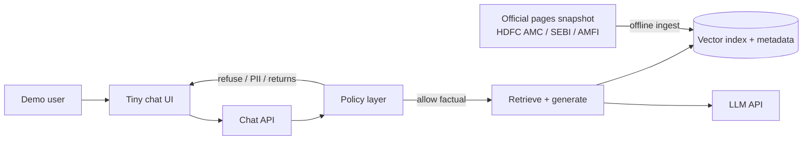
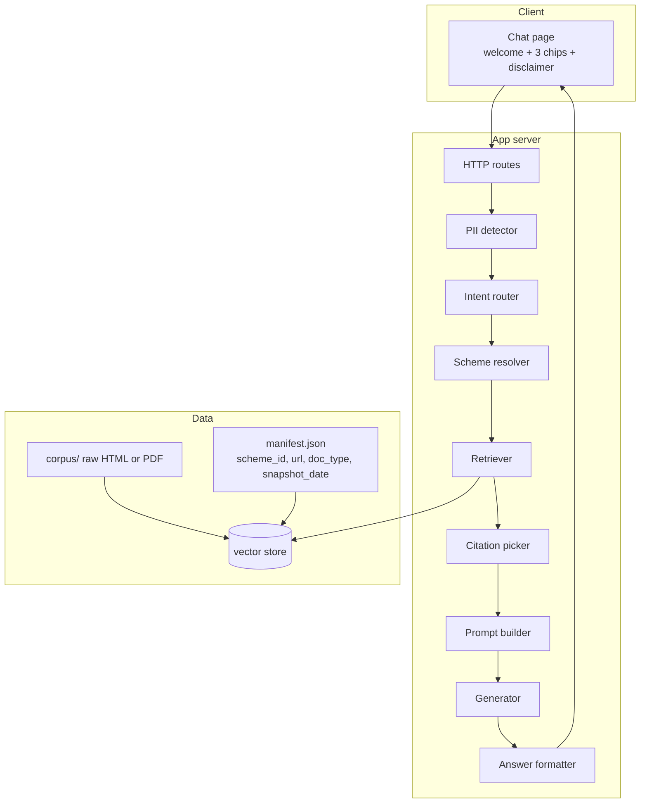

# Architecture
## Mutual Fund Facts-Only FAQ Assistant (RAG Chatbot)

**Product:** Class-demo RAG chatbot  
**Aligned to:** [PRD.md](./PRD.md) v1.0  
**Date:** 27 September 2026  
**Status:** Demo architecture  

This document describes how the prototype is built so it can meet the PRD: **retrieve official text, answer in ≤ 3 sentences, cite one public URL, refuse advice, reject PII.**

---

## 1. Design goals

| Goal | Architectural choice |
|---|---|
| Ground answers in official pages (FR-2) | RAG: generate only from retrieved chunks |
| One citation every time (FR-3) | Store `source_url` on every chunk; pick the URL of the top used chunk |
| No invented numbers | Retrieval gate: if score/chunks fail, return “not in index” + fallback official link |
| No advice / no returns math (FR-6, FR-7) | Intent classifier **before** generation; skip retrieval for advice; factsheet-only path for performance |
| No PII (FR-8) | Regex/heuristic PII filter on input; do not log raw query if PII detected |
| Tiny UI (FR-9) | Single-page chat; no auth, no session store beyond in-memory transcript |
| Class demo, not production | Local/snapshot index; one LLM API; no user database |

**Non-goals in architecture:** multi-tenant auth, live crawling during chat, analytics warehouse, AMC APIs, holdings/KYC.

---

## 2. System context



**External systems**

| System | Role |
|---|---|
| HDFC AMC / SEBI / AMFI public pages | Corpus and citation targets |
| Embedding + chat LLM (e.g. OpenAI-compatible API) | Embed chunks; generate short answers |
| Groww URLs | **Not in the system.** Scheme identifiers in the PRD only |

---

## 3. Components



| Component | Responsibility |
|---|---|
| **Chat UI** | Welcome, 3 example chips, disclaimer, input, transcript. Renders `answer`, `source_url`, `last_updated`. |
| **Chat API** | `POST /chat { question }` → structured JSON. Stateless per request. |
| **PII detector** | PAN / Aadhaar / account / OTP / email / phone patterns. On hit: canned refusal, **do not persist** the payload. |
| **Intent router** | `factual` \| `advice` \| `performance` \| `out_of_scope` \| `pii` (pii already handled). |
| **Scheme resolver** | Map aliases (e.g. “HDFC Equity Fund” ↔ flexi-cap scheme id). If ambiguous among the five, return clarification (FR-11). |
| **Retriever** | Embed query; filter by `scheme_id` when known; top-k chunks with scores. |
| **Citation picker** | Exactly **one** `source_url` from the highest-scoring chunk used in the answer. Allowlist: AMC/SEBI/AMFI hosts only. |
| **Prompt builder** | System rules from PRD §6 + retrieved text only. |
| **Generator** | LLM completion. Temperature low. |
| **Answer formatter** | Enforce ≤ 3 sentences; append `Source:` and `Last updated from sources:`. |
| **Ingest job** | Offline: fetch/save official pages, chunk, embed, write index + `snapshot_date`. |

---

## 4. Runtime flows

### 4.1 Offline ingest (once before demo)

```
official URLs (manifest)
  → download HTML/PDF
  → extract text
  → chunk (by heading / ~400–800 tokens, overlap)
  → attach metadata { scheme_id, doc_type, source_url, snapshot_date }
  → embed → upsert vector store
  → write CORPUS_SNAPSHOT_DATE
```

**Allowlisted hosts only** (example): `hdfcfund.com`, `amfiindia.com`, `sebi.gov.in` (and official subdomains). Reject Groww, blogs, aggregators at ingest.

### 4.2 Online question

```
question
  → PII check
       yes → refusal, no log of identifiers
  → intent
       advice        → canned refusal + one SEBI/AMFI education URL
       performance   → no compute; one factsheet URL for resolved scheme (or generic factsheet hub)
       out_of_scope  → “only these five HDFC schemes” + optional AMC funds page
       factual       → scheme resolve → retrieve → gate → generate → format
```

**Retrieval gate (anti-hallucination)**

- If `top_score < threshold` or no chunks: do **not** call the LLM to invent facts.
- Response: fact not in indexed pages + **one** fallback official URL (scheme factsheet if scheme known, else AMC factsheet list).

---

## 5. Data model

### 5.1 Scheme catalog (static)

```text
scheme_id          e.g. hdfc_large_cap_direct_growth
display_name
category           large_cap | flexi_cap | elss | small_cap | hybrid
aliases[]          names users might type
factsheet_url      official, used as performance / low-confidence fallback
```

Five rows only, matching PRD §5.1.

### 5.2 Chunk record

```text
chunk_id
scheme_id          nullable for shared guides (statements, investor education)
doc_type           factsheet | kim | sid | faq | fees | riskometer | statements | education
source_url         citation target (single page)
snapshot_date      YYYY-MM-DD
text
embedding
```

### 5.3 Chat API response

```json
{
  "type": "factual | refusal | pii | clarify | not_found",
  "answer": "… at most three sentences …",
  "source_url": "https://…",
  "last_updated": "2026-09-27",
  "scheme_id": "hdfc_elss_direct_growth | null"
}
```

UI always shows `source_url` and `last_updated` for every `type` except perhaps `pii` (still include an official privacy/education or AMC contact page if desired; PRD requires a source on answers — use a generic official link for PII refuse).

**No tables:** users, messages, PAN, session analytics. Optional in-memory list for the open browser tab only.

---

## 6. Policy and prompts

### 6.1 Intent signals (deterministic first)

Cheap rules before the LLM:

| Intent | Signals |
|---|---|
| Advice | should I, buy, sell, invest in, better than, recommend, allocate, portfolio |
| Performance | return, CAGR, best performing, 1y/3y/5y, outperform |
| PII | PAN regex, 12-digit Aadhaar, OTP, `@` email, Indian mobile, account-like digit runs |
| Factual | expense ratio, TER, exit load, SIP, lock-in, ELSS, riskometer, benchmark, statement, capital gains |

Ambiguous → treat as factual and let retrieval + prompt constrain; if still advice-like, generator must refuse.

### 6.2 System prompt contract

The generator must:

1. Use **only** the provided chunks.
2. Output **at most 3 sentences** of body text.
3. Not give buy/sell or allocation advice.
4. Not calculate or rank returns.
5. Not ask for or repeat PII.
6. If chunks do not contain the number, say it is not in the provided sources.

Citation and date are **appended by the formatter**, not trusted from the model.

### 6.3 Single citation rule

`source_url = chunks_used[0].source_url` after ranking (or the chunk with the highest overlap to the generated claim). Never concatenate multiple links in the required slot.

---

## 7. Suggested demo stack

Keep the class demo small:

| Layer | Suggestion |
|---|---|
| UI | Static HTML/JS or Streamlit / Gradio — one page |
| API | Python FastAPI **or** Streamlit callbacks (no separate API if simpler) |
| Embeddings + chat | One vendor API (or local model if the classroom has no keys) |
| Vector store | Chroma / FAISS on disk in `data/index/` |
| Corpus | `data/corpus/` files + `data/manifest.json` |
| Config | `CORPUS_SNAPSHOT_DATE`, model names, score threshold, allowlisted hosts |

Swap components freely; **do not** change the flows in §4 or the response contract in §5.3.

---

## 8. Trust boundaries

```text
Browser  →  App process  →  LLM provider
                ↑
         local index (official text snapshot)
```

- User text is sent to the LLM **only** after PII strip/block.
- LLM never receives live AMC credentials; there are none.
- Index contains public documents only.
- Do not screenshot or ingest AMC logged-in backends (PRD constraint).

---

## 9. Failure modes

| Failure | User-visible behaviour |
|---|---|
| LLM timeout | “Service busy. Open the factsheet: \<url\>” + last updated |
| Empty index | Startup check fails; do not demo empty RAG |
| Unknown scheme / other AMC | Out-of-scope message + list of five schemes |
| Multiple schemes in one question | Clarify **or** answer only if both facts are in retrieved chunks; still **one** citation (primary scheme) |
| Citation host not allowlisted | Drop chunk at ingest; never show Groww as Source |

---

## 10. Mapping to PRD requirements

| PRD | Architecture |
|---|---|
| FR-1 | Chat API + formatter sentence cap |
| FR-2 | Retriever + “chunks only” prompt + retrieval gate |
| FR-3 | Chunk `source_url` + citation picker + host allowlist |
| FR-4 | `CORPUS_SNAPSHOT_DATE` on every response |
| FR-5 | Manifest covers 5 schemes × FAQ intents |
| FR-6 | Intent `advice` short-circuit |
| FR-7 | Intent `performance` → factsheet URL, no calculator |
| FR-8 | PII detector; no persistence |
| FR-9 | UI shell |
| FR-10 | Retrieval gate + fallback official URL |
| FR-11 | Scheme catalog aliases + clarify response type |

---

## 11. Demo deployment

**Default:** run locally (`localhost`). Index pre-built in the repo or generated by `scripts/ingest.py` before class.

**Optional:** one shared URL (same app, still no auth). Snapshot date stays frozen; no live recrawl during the 3-minute demo.

**Pre-demo checklist**

1. Ingest completed; index non-empty for all five `scheme_id`s  
2. Gold-set 10 questions run once (PRD §11)  
3. Allowlist rejects a Groww URL if someone adds it  
4. UI chips match PRD example questions  
